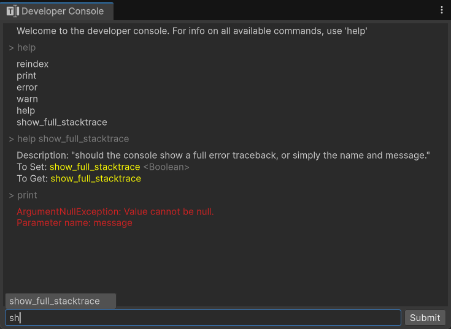
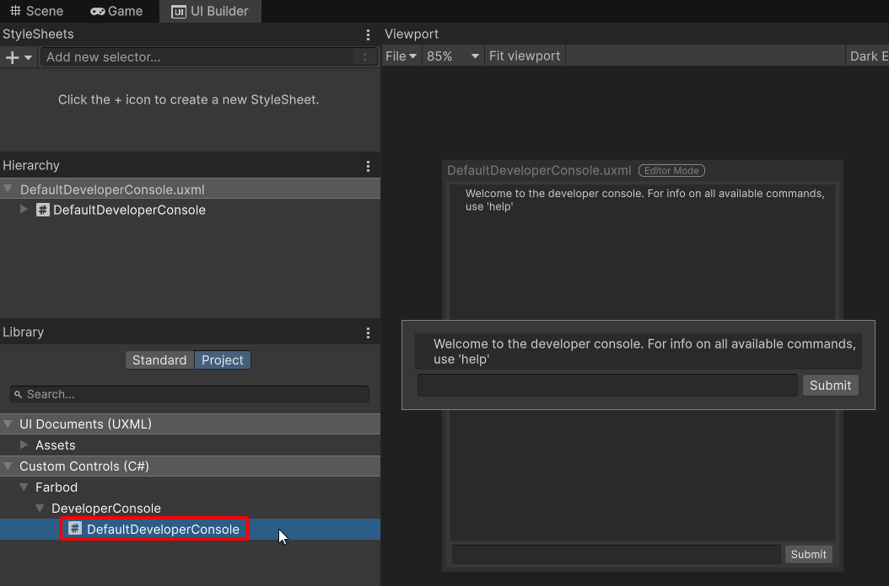

# About

A Source-Engine type runtime developer console for executing commands, and setting variables.
This tool can be use in Editor AND RUNTIME!
You can access the Built-In editor window from `Toolbar > Tools > Developer Console`.



## How it works
The static `DeveloperConsole` class is the one that executes the commands and has the callbacks for logging things to the console.

### Registering commands
you can register a console method command by adding the `ConsoleMethod` attribute to a **static** method :
```cs
[ConsoleMethod("pow", "raise a to the power of b.")]
public static void CalculatePower(int a, int b)
{
    Debug.Log(result);
}
```

### Registering Console-Variables
you can register a console console variable by adding the `ConsoleVariable` attribute to a static Field or Property:
```cs
// RuntimeManager Singleton

[ConsoleVariable("coin", "directly set the player's coin count")]
public static int Coins = 200;


private static int gameDifficulty = 0;

[ConsoleVariable("difficulty", "the difficulty index of the game. (0 to 3)")]
public static int GameDifficulty
{
    get{ return gameDifficulty; }
    set
    {
        if (value < 0 || value > 3)
            throw new ArgumentOutOfRangeException(nameof(value));

        gameDifficulty = value;
    }
}
```


## Runtime User-Interface
You can use the provided `DeveloperConsole` element within your own menus, and apply your own custom styling; or build a custom interface to interact with this class using the UI-Toolkit, UGUI or the classic Gameobject UI Canvas and monobehaviors.


Feel free to look at the source code of the `DeveloperConsole.cs` element to see how to use features such as autocomplete.


* Created by [Farbod Nejati](https://github.com/FarbodNejati)
* Inspired by [ZeroByter](https://github.com/ZeroByter/SourceConsole/tree/master)
