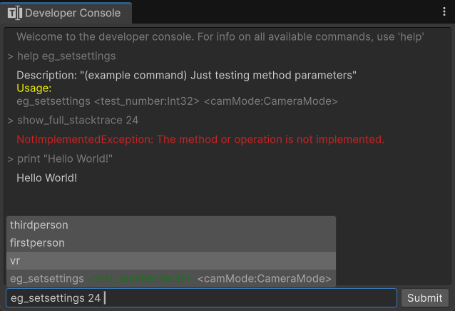

# About

A SourceEngine-type  developer console for executing commands, and setting variables.
This tool can be use in Editor AND RUNTIME!
You can access the Built-In editor window from `Toolbar > Tools > Developer Console`.



### Installation
Install this package by opening the packag manager and installing by git url and emtering the following:

```https://github.com/FarbodNejati/SourceDeveloperConsole.git```

### Registering commands
you can register a console method command by adding the `ConsoleMethod` attribute to a **static** method :
```cs
[ConsoleMethod("pow", "raise a to the power of b.")]
public static int CalculatePower(int a, int b) => Math.Pow(a, b); //The return object will be printed onto the console
```

### Registering Console-Variables
you can register a console console variable by adding the `ConsoleVariable` attribute to a Field or Property:
```cs
// You can get/set fields through commands
[ConsoleVariable("coin", "directly set the player's coin count")]
public static int Coins = 200;
```
```cs
//Control properties with backing fields. the backing field could be on an object instance, while the property is static.
private int gameDifficulty = 0;
[ConsoleVariable("difficulty", "the difficulty index of the game. (0 to 3)")]
public static int GameDifficulty
{
    get{
        if (singleton_instance == null)
            throw new Exception("No GameManager instance is present");
        return singleton_instance.gameDifficulty;
    }
    set
    {
        if (singleton_instance == null)
            throw new Exception("No GameManager instance is present");
        if (value < 0 || value > 3)
            throw new ArgumentOutOfRangeException(nameof(value));
        singleton_instance.gameDifficulty = value;
    }
}
```


## Runtime User-Interface
You can use the provided `DefaultDeveloperConsole` element within your own menus, and apply your own custom styling; or build a custom interface to interact with this class using the UI-Toolkit, UGUI or the classic Gameobject UI Canvas and monobehaviors.

I'm currently using the provided UIElement in ny own project, just with ny own styling to make it look unique.

Feel free to look at the source code of the `DeveloperConsole.cs` element to see how to use features such as autocomplete.

## How it works
* The static `DeveloperConsole` class is the one that executes the commands and has the callbacks for logging things to the console.

* The `CommandParser` class is in charge of parsing inputted strings into usable commands and arguments, which are then executed by the `DeveloperConsole`

* And the `ConsoleSuggestionHandler` class is for providing auto-completion suggestions, and command usage hints as you type, that tells you what arguments to type, and helps you see if your input is valid or not by color coding the hint text. (exaples: command names, enum types, boolean true/false)


---

* Created by [Farbod Nejati](https://github.com/FarbodNejati)
* Inspired by [ZeroByter](https://github.com/ZeroByter/SourceConsole/tree/master)
